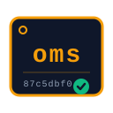

<div align="center">



# Oh-My-Skills

**The verified instruction files [Skill Forge](https://github.com/armelhbobdad/bmad-module-skill-forge) produces when you point it at real libraries. Nothing is made up — every line traces back to a commit SHA.**

[](LICENSE)
[](#the-four-skills-pinned)
[](#dont-trust-us-audit-us)
[](https://agentskills.io)
[](https://github.com/armelhbobdad/bmad-module-skill-forge)
[](https://discord.gg/gk8jAdXWmj)
[](https://github.com/armelhbobdad/oh-my-skills/stargazers)

**If these skills saved you from hallucinations, [grab me a coffee ☕](https://buymeacoffee.com/armelhbobdad) — it helps me keep forging.**

</div>

---

Your AI coding assistant doesn't read documentation. It pattern-matches against a snapshot of the internet from months ago, and then confidently writes code against functions that were deprecated two releases back. You find out after three stack traces and a trip to GitHub to read the source — which is where the assistant should have been looking all along.

This repository is the antidote. Not more curation. **Compilation.** Each skill is built from a specific upstream commit by an AST parser (not an LLM), every documented symbol cites its source file and line, and every claim can be audited against the upstream in under 60 seconds. When we're wrong, the test report says we're wrong.

This repo is what [Skill Forge](https://github.com/armelhbobdad/bmad-module-skill-forge) produces. Four libraries today, all Deep-tier, all scoring **99.0%–99.49%** against their own source trees. The receipts are below — so is the demo, the dare, and the one we lost.

> **Who this is for:** devs tired of debugging hallucinated imports · library maintainers who want their users' agents to stop getting the API wrong · skeptical staff engineers who want evidence, not vibes.

---

## See it work in 30 seconds

Storybook shipped v10 in early 2026. It consolidated ~40 separate `@storybook/*` packages into a single `storybook` package. Your AI assistant's training data hasn't caught up.

**Without the skill**, your assistant confidently writes:

```tsx
// Imports that haven't existed since v9.
import { fn } from '@storybook/test';
import { useArgs } from '@storybook/preview-api';
```

**With [`oms-storybook-react-vite`](skills/oms-storybook-react-vite/10.3.5/oms-storybook-react-vite/SKILL.md) installed**, it reads the skill first and writes:

```tsx
// v10 consolidated imports — no @ prefix, no dash, just `storybook/X`.
// Verified against skills/oms-storybook-react-vite/10.3.5/.../SKILL.md (migration table)
// Pinned at storybookjs/storybook @ e486d382 · 2026-04-07.
import { fn } from 'storybook/test';
import { useArgs } from 'storybook/preview-api';
```

No hallucinations. No guesswork. Just a parser reading real code.

---

## The four skills, pinned

| If you're writing... | Version | Test score | Upstream source | Pinned at |
|---|---|---|---|---|
| [**cocoindex**](skills/oms-cocoindex/1.0.0/oms-cocoindex/SKILL.md) (Python) | 1.0.0 | [**99.0%**](forge-data/oms-cocoindex/1.0.0/test-report-oms-cocoindex-20260424T235130Z-281688-535f.md) | [`cocoindex-io/cocoindex`](https://github.com/cocoindex-io/cocoindex) | [`5fe4f37a`](https://github.com/cocoindex-io/cocoindex/commit/5fe4f37a526e51516655832ec9814e7ca24ade9a) · 2026-04-22 |
| [**cognee**](skills/oms-cognee/1.0.0/oms-cognee/SKILL.md) (Python) | 1.0.0 | [**99.0%**](forge-data/oms-cognee/1.0.0/test-report-oms-cognee.md) | [`topoteretes/cognee`](https://github.com/topoteretes/cognee) | [`3c048aa4`](https://github.com/topoteretes/cognee/commit/3c048aa4147776f14d4546704f986242554a9ef3) · 2026-04-11 |
| [**Storybook**](skills/oms-storybook-react-vite/10.3.5/oms-storybook-react-vite/SKILL.md) (React + Vite, TS) | 10.3.5 | [**99.49%**](forge-data/oms-storybook-react-vite/10.3.5/test-report-oms-storybook-react-vite.md) | [`storybookjs/storybook`](https://github.com/storybookjs/storybook) | [`e486d382`](https://github.com/storybookjs/storybook/commit/e486d3826bcd40c52db1c766966d1c8ec16df6cb) · 2026-04-07 |
| [**uitripled**](skills/oms-uitripled/0.1.0/oms-uitripled/SKILL.md) (TS) | 0.1.0 | [**99.45%**](forge-data/oms-uitripled/0.1.0/test-report-oms-uitripled.md) | [`moumen-soliman/uitripled`](https://github.com/moumen-soliman/uitripled) | [`a5ffb45b`](https://github.com/moumen-soliman/uitripled/commit/a5ffb45be05335d2c547436664cfbfb8c22d04df) · 2026-03-22 |

**Staleness has a date.** Every row above carries the upstream's own commit date. Your `.cursorrules` file doesn't. When upstream ships, we recompile and publish a new skill version next to the old one — never in place.

**Not listed?** [Open an issue](https://github.com/armelhbobdad/oh-my-skills/issues) — we'd rather compile it than let your assistant improvise it. If you maintain the library and want an official skill, see [CONTRIBUTING.md](CONTRIBUTING.md).

---

## Install

The [`skills`](https://www.npmjs.com/package/skills) CLI from [Vercel Labs](https://github.com/vercel-labs/skills) installs any skill from a GitHub URL — and it's the same CLI that powers [skills.sh](https://skills.sh), the open agent-skills directory where SKF-compatible skills are listed and ranked. One command, one placeholder:

```bash
npx skills add https://github.com/armelhbobdad/oh-my-skills/tree/main/skills/<SKILL>
```

Replace `<SKILL>` with the path for the skill you want:

| Skill                    | `<SKILL>` path                                           |
| ------------------------ | -------------------------------------------------------- |
| oms-cocoindex            | `oms-cocoindex/1.0.0/oms-cocoindex`                      |
| oms-cognee               | `oms-cognee/1.0.0/oms-cognee`                            |
| oms-storybook-react-vite | `oms-storybook-react-vite/10.3.5/oms-storybook-react-vite` |
| oms-uitripled            | `oms-uitripled/0.1.0/oms-uitripled`                      |

The CLI drops the package under your project's skills directory (`.claude/skills/` for Claude Code, `.cursor/rules/` for Cursor, etc.). After install, paste the skill's `context-snippet.md` into the SKF-managed block of your `CLAUDE.md` / `AGENTS.md` / `.cursorrules` — see this repo's own [`CLAUDE.md`](CLAUDE.md) for the expected block format.

### Why two files? (SKILL.md + context-snippet.md)

Every skill ships **two** files on purpose. `SKILL.md` is the full instruction set — loaded only when a trigger fires. `context-snippet.md` is an 80–120 token compressed index injected into your agent's baseline context so it *knows the skill exists in the first place* and reaches for it at the right moment. Without the snippet, the agent never knows to open `SKILL.md`; without `SKILL.md`, the snippet has nothing to point at.

This dual-output strategy isn't a style choice — it closes a measured performance gap. Per [Skill Forge → Dual-Output Strategy](https://armelhbobdad.github.io/bmad-module-skill-forge/how-it-works/#dual-output-strategy), Vercel research shows passive context (`CLAUDE.md` / `AGENTS.md`) achieves a **100% pass rate vs. 79% for active skills loaded alone**. Passive knowledge of what exists is what turns "skill available" into "skill used." Both halves ship in every package in this repo.

**Manual install** (for monorepo vendoring):

```bash
cp -r skills/oms-cocoindex/1.0.0/oms-cocoindex .claude/skills/oms-cocoindex
```

> **Upstream shipped a new version?** Your existing install never changes itself — see [What happens when the library ships a new version?](#what-happens-when-the-library-ships-a-new-version) below.

---

## How this compares to what you already use

A skeptical reader is already comparing this repo to four things in their head. Here's the grid:

|                            | **Oh-My-Skills**                | MCP doc servers    | Hand-edited `.cursorrules` | awesome-\* lists |
| -------------------------- | ------------------------------- | ------------------ | -------------------------- | ---------------- |
| Reproducible from source   | commit SHA + AST parser         | varies; opaque     | whatever you wrote         | none             |
| Version-pinned & immutable | yes, per-version directories    | runtime-dependent  | rots silently              | no               |
| Audit trail                | `provenance-map.json` + report  | depends on server  | none                       | none             |
| Runtime cost               | zero (markdown + JSON)          | a running process  | zero                       | zero             |
| Staleness visible          | upstream commit date in README  | no                 | no                         | no               |
| Falsifiable                | yes — three steps, 60 seconds   | rarely             | no                         | no               |

The others aren't bad. They solve different problems. This repo solves exactly one: **the claim your agent is reading was true at a specific commit on a specific day, and you can prove it.**

---

## Don't trust us. Audit us.

Pick any symbol in any skill. You can trace it to the exact line of upstream source in under 60 seconds. **We are not asking for your trust. We are handing you the tools to withdraw it.**

1. **Open `skills/<name>/<version>/<name>/metadata.json`** — note `source_commit` and `source_repo`. This is the anchor.
2. **Open `forge-data/<name>/<version>/provenance-map.json`** — find your symbol. This is a real entry from `oms-cocoindex` v1.0.0; the line number is not rounded, the commit SHA is not illustrative:
   ```json
   {
     "export_name": "lifespan",
     "export_type": "function",
     "params": ["fn: LifespanFn | None = None"],
     "return_type": "Any",
     "source_file": "python/cocoindex/_internal/environment.py",
     "source_line": 452,
     "confidence": "T1",
     "extraction_method": "ast-grep"
   }
   ```
3. **Visit the upstream repo at the pinned commit.** Jump to that file and line. If the signature in `SKILL.md` doesn't match, **that's a bug.** Open an issue. We fix it, publicly, with a new commit SHA and a new provenance map. That is the entire deal.

For the deeper trails — extraction rules, evidence reports, per-skill denominator disclosures — see [TRUST.md](TRUST.md).

---

## The scores, including the one we lost

**A promise of perfection is suspicious. A promise of visible fallibility is trustworthy.**

The lowest test score in this repo is **99.0%**. The highest is **99.49%**. The score is a weighted average of four deterministic measurements (Coherence is redistributed because each skill runs in naive mode):

| Weight  | Dimension             | What it measures                                                                                                    |
| ------- | --------------------- | ------------------------------------------------------------------------------------------------------------------- |
| **45%** | Export Coverage       | `(documented exports / source exports) × 100` — what fraction of the library's public API is in `SKILL.md`?         |
| **25%** | Signature Accuracy    | Do documented function signatures match the real ones at the pinned commit — parameter names, types, order, return? |
| **20%** | Type Coverage         | Are the types and interfaces referenced in exports fully documented?                                                |
| **10%** | External Validation   | Average of [`skill-check`](https://github.com/thedaviddias/skill-check) quality score and [`tessl`](https://tessl.io) content score |

Pass threshold is 80% — anything below fails the gate and triggers `update-skill`, not `export-skill`. The full arithmetic, per-skill denominators, and reproducibility steps live in [TRUST.md](TRUST.md#how-the-99-is-computed).

**GAP-004 — the one we lost.** `oms-storybook-react-vite` scores **215/216**, not 216/216. The 1-entry drift is logged openly in the test report as GAP-004 and discussed in [TRUST.md](TRUST.md#gap-004-the-one-we-lost). We didn't hide the rough edge. We wrote it down.

---

## What happens when the library ships a new version?

Skills are pinned to a **source commit**, not a floating tag. When upstream ships, we recompile and publish a new skill version alongside the old one. **Your existing install will never change its mind while you sleep.**

This is not a hypothetical — it is what already happened to `oms-cognee`. Upstream `topoteretes/cognee` shipped v1.0.0 on top of the v0.5.8 surface this repo was originally compiled against. We recompiled from the v1.0.0 commit and wrote the new skill version next to the old one:

```
skills/oms-cognee/
  0.5.8/oms-cognee/   ← still pinned to b51dcce1 (v0.5.8), scoring 99.45%
  1.0.0/oms-cognee/   ← pinned to 3c048aa4 (v1.0.0, 2026-04-11), current, scoring 99.00%
  active              → symlink to the current version
```

The v0.5.8 tree was never re-pinned. Its [`metadata.json`](skills/oms-cognee/0.5.8/oms-cognee/metadata.json) still anchors `source_commit: b51dcce1`, and its [test report](forge-data/oms-cognee/0.5.8/test-report-oms-cognee.md) still scores the v0.5.8 API surface. A project that pinned `CLAUDE.md` to `skills/oms-cognee/0.5.8/oms-cognee` before the v1.0.0 recompile continues to resolve against that tree today, with zero upstream drift. When the team is ready to adopt v1.0.0's new surface (e.g. `run_startup_migrations` replacing `run_migrations`, `cognee.low_level` moved out of the public API), they bump the path in `CLAUDE.md` — one line, reviewable in a PR — the same way they would bump a `package.json` dependency.

The [export manifest](skills/.export-manifest.json) records the full version history, marking `0.5.8` as `archived` and `1.0.0` as `active`. Upgrades are install-a-new-version, never mutate-in-place.

---

## What we said no to, and why

Skill Forge can do a lot of things. This repo deliberately ships the narrowest useful slice.

- **No "official" authority claim.** All four skills are tagged `source_authority: community` in `metadata.json`. Only library maintainers can publish official skills through the [agentskills.io](https://agentskills.io) open-format ecosystem ([spec repo](https://github.com/agentskills/agentskills), Anthropic-maintained). **Authority is a costume; audit is a garment.** These are accurate community builds — audited, not blessed.
- **No MCP server, no runtime.** Skills are plain markdown and JSON. No process to run, no port to open, no dependency to manage. Your assistant reads them like any other file in the repo. If you want runtime doc-fetch, use an MCP server — this repo solves a different problem: reproducible, version-controlled, **grep-able** context.
- **No "curated" anything.** Every awesome-list on GitHub is curated. Curation is trust-by-vibes. What this repo ships is **compilation** — extracted by an AST parser, tested against the source, shipped with a receipt. *The skills are the demo; the pipeline is the moat.*
- **No silent updates.** Each skill version is immutable. Your install will never change its mind while you sleep.

## How the skills are built

Every step below exists because one failure mode of training-data docs had to die.

Skills are compiled by [**Skill Forge**](https://github.com/armelhbobdad/bmad-module-skill-forge), a [BMAD](https://github.com/bmad-code-org/BMAD-METHOD) module that runs a six-step pipeline against the upstream source:

1. **Brief** (`skf-brief-skill`) — scope, goals, non-goals. *Kills:* unbounded scope, doc-dumps that bury the public API.
2. **Extract** — AST enumeration via [ast-grep](https://github.com/ast-grep/ast-grep) against an ephemeral sparse-checkout clone at the pinned tag. *Kills:* LLM-paraphrased signatures that drift from source.
3. **Enrich** — fetch temporal context (issues, PRs, releases, docs) and index into a local [QMD](https://github.com/tobi/qmd) collection. *Kills:* skills that know the API but miss the deprecation drama around it.
4. **Compile** — author `SKILL.md`, references, and `context-snippet.md` with inline provenance citations. *Kills:* the gap between "documented" and "cited."
5. **Test** (`skf-test-skill` · [Skill Forge → Workflows](https://armelhbobdad.github.io/bmad-module-skill-forge/workflows/)) — coverage, coherence, external validators, single numeric score against an 80% threshold. *Kills:* unbacked confidence — see GAP-004 above.
6. **Export** (`skf-export-skill`) — write `context-snippet.md` into target context files as a managed block. *Kills:* the last-mile step where a reader wires a skill into their agent and forgets.

Full reference: [Skill Forge → Docs](https://armelhbobdad.github.io/bmad-module-skill-forge/).

---

## Repository layout

```
skills/
  <name>/<version>/<name>/
    SKILL.md            Main skill document
    context-snippet.md  Compressed passive-injection block
    metadata.json       Source commit, exports, coverage stats, deps
    references/         Deep-dive reference files

forge-data/
  <name>/
    skill-brief.yaml        Scope, goals, non-goals
    <version>/
      evidence-report.md    Full AST extraction output with citations
      provenance-map.json   Symbol → source file/line mapping
      extraction-rules.yaml ast-grep patterns used during compilation
      test-report-*.md      Coverage + coherence + score
```

The split is intentional: `skills/` ships to consumers, `forge-data/` is the audit trail.

## Who maintains this

I'm [Armel](https://github.com/armelhbobdad). I built [Skill Forge](https://github.com/armelhbobdad/bmad-module-skill-forge) because my own agents kept lying to me about libraries I use every day, and I keep **oh-my-skills** as the reference output — the proof the pipeline does what it says.

Issues are the fastest way to flag a drift, request a new library, or open a conversation: [github.com/armelhbobdad/oh-my-skills/issues](https://github.com/armelhbobdad/oh-my-skills/issues). Longer-form discussion happens on the [BMAD-METHOD Discord](https://discord.gg/gk8jAdXWmj).

---

## Contributing

See [CONTRIBUTING.md](CONTRIBUTING.md). New skills are welcome — the recommended path is to run Skill Forge against the upstream source and submit both the `skills/` and `forge-data/` trees together. The second one is what lets reviewers verify the first one.

## License

Apache-2.0 — see [LICENSE](LICENSE).

---

> Four libraries. Every line traceable. Every test report showing its own scars. Fork the repo, pick a symbol, break the claim — or send this to the teammate still debugging yesterday's hallucination.

[](https://github.com/armelhbobdad/oh-my-skills/graphs/contributors)

See [CONTRIBUTORS.md](CONTRIBUTORS.md) for contributor information.
