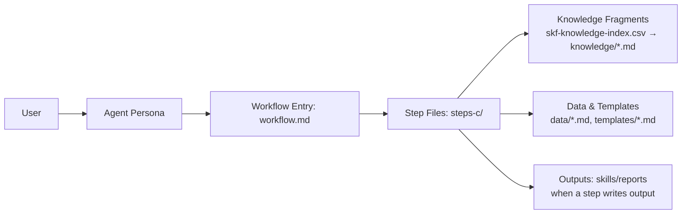

# How It Works

This page is for people who want to understand how SKF works under the hood. It covers the BMad framework, workflow architecture, capability tiers, output format, tool ecosystem, and key design decisions. For plain-English definitions of key terms, see [Concepts](../concepts.md).

---

## How BMad Works

BMad works because it turns big, fuzzy work into **repeatable workflows**. Each workflow is broken into small steps with clear instructions, so the AI follows the same path every time. It also uses a **shared knowledge base** (standards and patterns) so outputs are consistent, not random. In short: **structured steps + shared standards = reliable results**.

## How SKF Fits In

SKF plugs into BMad the same way a specialist plugs into a team. It uses the same step-by-step workflow engine and shared standards, but focuses exclusively on skill compilation and quality assurance. That means you get **evidence-based agent skills**, **AST-verified instructions**, and **drift detection** that align with the rest of the BMad process.

---

## Architecture & Flow

BMad is a small **agent + workflow engine**. There is no external orchestrator — everything runs inside the LLM context window through structured instructions.

### Building Blocks

Each workflow directory contains these files, and each has a specific job:

| File                      | What it does                                                                                                        | When it loads                                     |
|---------------------------|---------------------------------------------------------------------------------------------------------------------|---------------------------------------------------|
| `forger.agent.yaml`       | Expert persona — identity, principles, critical actions, menu of triggers                                           | First — always in context                         |
| `workflow.md`             | Human-readable entry point — goals, mode menu (Create/Edit/Validate), routes to first step                          | Second — presents mode choice                     |
| `steps-c/*.md`            | **Create** steps — primary execution, 4-9 sequential files                                                          | One at a time (just-in-time)                      |
| `data/*.md`               | Workflow-specific reference data — schemas, heuristics, rules, patterns                                             | Read by steps on demand                           |
| `templates/*.md`          | Output skeletons with placeholder vars — steps fill these in to produce the final artifact                          | Read by steps when generating output              |
| `skf-knowledge-index.csv` | Knowledge fragment index — id, name, tags, tier, file path                                                          | Read by steps to decide which fragments to load   |
| `knowledge/*.md`          | 10 reusable fragments — cross-cutting principles and patterns (e.g., `zero-hallucination.md`, `confidence-tiers.md`) | Selectively read into context when a step directs |



### How It Works at Runtime

1. **Trigger** — User types `@Ferris CS` (or fuzzy match like `create-skill`). The agent menu in `forger.agent.yaml` maps the trigger to the workflow path.
2. **Agent loads** — `forger.agent.yaml` injects the persona (identity, principles, critical actions) into the context window. Sidecar files (`forge-tier.yaml`, `preferences.yaml`) are loaded for persistent state.
3. **Workflow loads** — `workflow.md` presents the mode choice and routes to the first step file.
4. **Step-by-step execution** — Only the current step file is in context (just-in-time loading). Each step explicitly names the next one. The LLM reads, executes, saves output, then loads the next step. No future steps are ever preloaded.
5. **Knowledge injection** — Steps consult `skf-knowledge-index.csv` and selectively load fragments from `knowledge/` by tags and relevance. Cross-cutting principles (zero hallucination, confidence tiers, provenance) are loaded only when a step directs — not preloaded.
6. **Data injection** — Steps read `data/*.md` files as needed (schemas, heuristics, extraction patterns). This is deliberate context engineering: only the data relevant to the current step enters the context window.
7. **Templates** — When a step produces output (e.g., a skill brief or test report), it reads the template file and fills in placeholders with computed results. The template provides consistent structure; the step provides the content.
8. **Progress tracking** — Each step appends to an output file with state tracking. Resume mode reads this state and routes to the next incomplete step.

### Ferris Operating Modes

Ferris operates in four workflow-driven modes (mode is determined by which workflow is running, not conversation state):

| Mode          | Workflows          | Behavior                                                    |
|---------------|--------------------|-------------------------------------------------------------|
| **Architect** | SF, AN, BS, CS, QS, SS | Exploratory, assembling — discovers structure and scope     |
| **Surgeon**   | US                 | Precise, preserving — extracts and compiles with provenance |
| **Audit**     | AS, TS             | Judgmental, scoring — evaluates quality and detects drift   |
| **Delivery**  | EX                 | Packaging, ecosystem-ready — bundles for distribution       |

---

## Why Another Tool?

AI agents hallucinate APIs. Not sometimes — constantly. The table below shows why every existing approach fails at scale:

| Approach | Strength | Fatal Flaw |
|----------|----------|------------|
| `npx skills init` | Format compliant | Empty shell. 0% intelligence. |
| LLM Summarization | High semantic context | Hallucination. Guesses parameters. No grounding. |
| RAG / Context stuffing | Good retrieval | Fragmented. Finds snippets, fails to synthesize. |
| Manual Authoring | High initial quality | Drift. Doesn't scale. |
| Copilot/Cursor built-in | Convenient | Generic. Doesn't know YOUR integration patterns. |
| **Skill Forge** | **Structural truth + automation** | **Rigid. (Feature, not bug.)** |

SKF solves this by mechanically extracting function signatures, type definitions, and usage patterns from code repositories — and enriching them with documentation and developer discourse — then compiling everything into verifiable, version-pinned skills that comply with the [agentskills.io specification](https://agentskills.io/specification).

---

## Progressive Capability Model

SKF uses an additive tier model. Each tier is the previous tier plus one tool. You never lose capability by adding a tool.

| Tier | Tools | What You Get |
|------|-------|-------------|
| **Quick** | `gh_bridge` + `skill-check` + `tessl` | Source reading + spec validation + content quality review. Best-effort skills in under a minute. |
| **Forge** | + `ast_bridge` | Structural truth. AST-verified signatures. Co-import detection. T1 confidence. |
| **Deep** | + `qmd_bridge` | Knowledge search. Temporal provenance. Drift detection. Full intelligence. |

Setup detects your installed tools and sets your tier automatically:

```
@Ferris SF
```

```
Forge initialized. Tools: gh, ast-grep, QMD. Tier: Deep. Ready.
```

Don't have ast-grep or QMD yet? No problem — Quick mode works with just the GitHub CLI. Install tools later; your tier upgrades automatically.

### Tier Override — Comparing Output Across Tiers

You can force a specific tier by setting `tier_override` in your preferences file (`_bmad/_memory/forger-sidecar/preferences.yaml`):

```yaml
# Force Forge tier regardless of detected tools
tier_override: Forge
```

This is useful for comparing skill quality across tiers for the same target:

```
# 1. Set tier_override: Quick in preferences.yaml
@Ferris CS                # compile at Quick tier

# 2. Change to tier_override: Forge
@Ferris CS                # recompile at Forge tier — compare output

# 3. Reset to tier_override: ~ (auto-detect)
```

Set `tier_override` to `Quick`, `Forge`, or `Deep`. Set to `~` (null) to return to auto-detection. The override is respected by all tier-aware workflows (CS, SS, US, AS, TS).

---

## Confidence Tiers

Every claim in a generated skill carries a confidence tier that traces to its source:

| Tier | Source | Tool | What It Means |
|------|--------|------|---------------|
| **T1** | AST extraction | `ast_bridge` | Current code, structurally verified. Immutable for that version. |
| **T2** | QMD evidence / source reading | `qmd_bridge` / `gh_bridge` | Historical + planned context (issues, PRs, changelogs, docs). |
| **T3** | External documentation | `doc_fetcher` | External, untrusted. Quarantined. |

### Temporal Provenance

Confidence tiers map to temporal scopes:

- **T1-now (instructions):** What ast-grep sees in the checked-out code. This is what your agent executes.
- **T2-past (annotations):** Closed issues, merged PRs, changelogs — why the API looks the way it does.
- **T2-future (annotations):** Open PRs, deprecation warnings, RFCs — what's coming.

Progressive disclosure controls how much context surfaces at each level:

| Output | Content |
|--------|---------|
| `context-snippet.md` | T1-now only — compressed, always-on |
| `SKILL.md` | T1-now + lightweight T2 annotations |
| `references/` | Full temporal context with all tiers |

### Tier Constrains Authority

Your forge tier limits what authority claims a skill can make:

| Forge Tier | AST? | QMD? | Max Authority | Accuracy Guarantee |
|-----------|------|------|---------------|-------------------|
| Quick | No | No | `community` | Best-effort |
| Forge | Yes | No | `official` | Structural (AST-verified) |
| Deep | Yes | Yes | `official` | Full (structural + contextual + temporal) |

---

## Output Architecture

### Per-Skill Output

Every generated skill produces a self-contained directory:

```
skills/{name}/
├── SKILL.md              # Active skill (loaded on trigger)
├── context-snippet.md    # Passive context (compressed, always-on)
├── metadata.json         # Machine-readable provenance
└── references/           # Progressive disclosure
    ├── {function-a}.md
    ├── {function-b}.md
    └── integrations/     # Stack skills only
        ├── auth-db.md
        └── pwa-auth.md
```

### SKILL.md Format

Skills follow the [agentskills.io specification](https://agentskills.io/specification) with frontmatter:

```yaml
---
name: payment-service
version: 2.1.0
description: Payment processing API skill — 23 verified functions
author: org/payment-team
---
```

Every instruction in the body traces to source:

```
Extracted: `getToken(userId: string, options?: TokenOptions): Promise<AuthToken>`
[AST:src/auth/index.ts:L42]. Confidence: T1.
```

### metadata.json — The Birth Certificate

Machine-readable provenance for every skill:

```json
{
  "name": "payment-service",
  "version": "2.1.0",
  "skill_type": "individual",
  "source_authority": "official",
  "source_repo": "github.com/org/payment-service",
  "source_commit": "a1b2c3d",
  "forge_tier": "forge",
  "spec_version": "1.3",
  "generated_at": "2026-02-25T14:30:00Z",
  "stats": {
    "exports_documented": 23,
    "exports_total": 23,
    "coverage": 1.0,
    "confidence_t1": 20,
    "confidence_t2": 3,
    "confidence_t3": 0
  }
}
```

### Stack Skill Output

Stack skills map how your dependencies interact — shared types, co-import patterns, integration points:

```
skills/{project}-stack/
├── SKILL.md              # Integration patterns + project conventions
├── context-snippet.md    # Compressed stack index
├── metadata.json         # Component versions, integration graph
└── references/
    ├── nextjs.md         # Project-specific subset
    ├── better-auth.md    # Project-specific subset
    └── integrations/
        ├── auth-db.md    # Cross-library pattern
        └── pwa-auth.md   # Cross-library pattern
```

The primary source is your project repo. Component references trace to library repos. `skill_type: "stack"` in metadata.

---

## Dual-Output Strategy

Based on [Vercel research](https://vercel.com/blog/agents-md-outperforms-skills-in-our-agent-evals): passive context (AGENTS.md/CLAUDE.md) achieves 100% pass rate vs 53% for active skills alone.

Every skill generates both:

1. **SKILL.md** — Active skill loaded on trigger with full instructions
2. **context-snippet.md** — Passive context, compressed index injected into CLAUDE.md

### Managed CLAUDE.md Section

Export injects a managed section between markers:

```markdown
<!-- SKF:BEGIN updated:2026-02-25 -->
[payment-service v2.1.0]|root: skills/payment-service/
|IMPORTANT: payment-service v2.1.0 — read SKILL.md before writing payment-service code. Do NOT rely on training data.
|quick-start:{SKILL.md#quick-start}
|api: getToken(), refreshToken(), revokeSession(), createSession()
|key-types:{SKILL.md#key-types} — TokenOptions, AuthToken, SessionConfig
|gotchas: all token methods async, session ID changed from userId in v2.0

[auth-service v1.5.0]|root: skills/auth-service/
|IMPORTANT: auth-service v1.5.0 — read SKILL.md before writing auth-service code. Do NOT rely on training data.
|quick-start:{SKILL.md#quick-start}
|api: getSession(), validateToken(), revokeSession(), createUser()
|gotchas: RBAC requires middleware setup, validateToken returns null not throw

[my-project-stack v1.0.0]|root: skills/my-project-stack/
|IMPORTANT: my-project-stack — read SKILL.md before writing integration code. Do NOT rely on training data.
|stack: next@15, better-auth@3, spacetimedb@1, serwist@9
|integrations: auth↔db, pwa↔auth
|gotchas: auth session type must match DB schema, update Serwist cache on auth flow changes
<!-- SKF:END -->
```

~80-120 tokens per skill (version-pinned, retrieval instruction, section anchors, inline gotchas). Aligned with [Vercel's research](https://vercel.com/blog/agents-md-outperforms-skills-in-our-agent-evals) finding that indexed format with explicit retrieval instructions dramatically improves agent performance. Developer controls placement. Ferris controls content. Snippet updates only happen at `export-skill` — create and update are draft operations.

---

## Tool Ecosystem

### 6 Tools

| Tool | Wraps | Purpose |
|------|-------|---------|
| **`gh_bridge`** | GitHub CLI (`gh`) | Source code access, issue mining, release tracking, PR intelligence |
| **`skill-check`** | [thedaviddias/skill-check](https://github.com/thedaviddias/skill-check) | Validation + auto-fix (`check --fix`), quality scoring (0-100), security scan, split-body, diff comparison |
| **`tessl`** | [tessl](https://tessl.io) | Content quality review, actionability scoring, progressive disclosure evaluation, AI judge with suggestions |
| **`ast_bridge`** | ast-grep CLI | Structural extraction, custom AST queries, co-import detection |
| **`qmd_bridge`** | QMD (local search) | BM25 keyword search, vector semantic search, collection indexing |
| **`doc_fetcher`** | Environment web tools | Remote documentation fetching for T3-confidence content. Tool-agnostic — uses whatever web fetching is available (Firecrawl, WebFetch, curl, etc.). Output quarantined as T3. |

### Conflict Resolution

When tools disagree, higher priority wins for instructions. Lower priority is preserved as annotations:

| Priority | Source | Tool |
|----------|--------|------|
| 1 (highest) | AST extraction | `ast_bridge` |
| 2 | QMD evidence | `qmd_bridge` |
| 3 | Source reading (non-AST) | `gh_bridge` |
| 4 | External documentation | `doc_fetcher` |

### Internal Utility

**`manifest_reader`** detects and parses dependency files across ecosystems:

- **Full support:** `package.json`, `pyproject.toml`, `requirements.txt`, `Cargo.toml`, `go.mod`
- **Basic support:** `build.gradle`, `pom.xml`, `Gemfile`, `composer.json`

---

## Workspace Artifacts

Build artifacts are committable — another developer can reproduce the same skill:

```
forge-data/{skill-name}/
├── skill-brief.yaml        # Compilation config
├── provenance-map.json     # Source map with AST bindings
├── evidence-report.md      # Build audit trail
└── extraction-rules.yaml   # Language-specific ast-grep schema
```

`skills/` and `forge-data/` are committed. Agent memory (`_bmad/_memory/forger-sidecar/`) is gitignored.

---

## Ownership Model

| Context | `source_authority` | Distribution |
|---------|-------------------|-------------|
| OSS library (maintainer generates) | `official` | `npx skills publish` to agentskills ecosystem |
| Internal service (team generates) | `internal` | `skills/` in repo, ships with code |
| External dependency (consumer generates) | `community` | Local `skills/`, marked as community |

Provenance maps enable verification: an `official` skill's provenance must trace to the actual source repo owned by the author.

---

## Key Design Decisions

| Decision | Rationale |
|----------|-----------|
| **Solo agent (Ferris), not multi-agent** | One domain (skill compilation) doesn't benefit from handoffs. Shared knowledge base (AST patterns, provenance maps) is the core asset. |
| **Workflows drive modes, not conversation** | Ferris doesn't auto-switch based on question content. Invoke a workflow to change mode. Predictable behavior. |
| **Hub-and-spoke cross-knowledge** | Each skill has one primary source. Cross-repo references use inline summary + pointer + `[XREF:repo:file:line]` provenance tag. |
| **Stack skill = compositional** | SKILL.md is the integration layer. references/ contains per-library + integration pairs. Partial regeneration on dependency updates. |
| **Snippet updates only at export** | Create/update are draft operations. Export publishes to skills/ and CLAUDE.md. No half-baked snippets. |
| **Bundle spec with opt-in update** | Offline-capable. 90-day staleness warning. `setup-forge --update-spec` fetches latest. |

---

## Knowledge Base

SKF relies on a curated skill compilation knowledge base:

- Index: `src/knowledge/skf-knowledge-index.csv`
- Fragments: `src/knowledge/`

Workflows load only the fragments required for the current task to stay focused and compliant.

## Module Structure

```
src/
├── module.yaml
├── module-help.csv
├── agents/
│   └── forger.agent.yaml
├── forger/
│   ├── forge-tier.yaml
│   ├── preferences.yaml
│   └── README.md
├── knowledge/
│   ├── skf-knowledge-index.csv
│   └── *.md (10 fragments)
└── workflows/
    ├── setup-forge/
    ├── analyze-source/
    ├── brief-skill/
    ├── create-skill/
    ├── quick-skill/
    ├── create-stack-skill/
    ├── update-skill/
    ├── audit-skill/
    ├── test-skill/
    └── export-skill/
```

---

## Security

- All tool wrappers use array-style subprocess execution — no shell interpolation
- Input sanitization: allowlist characters for repo names, file paths, patterns
- File paths validated against project root (no directory traversal)
- **Source code never leaves the machine.** All processing is local (AST, QMD, validation).
- `doc_fetcher` informs users which URLs will be fetched externally before processing

---

## Ecosystem Alignment

SKF produces skills compatible with the [agentskills.io](https://agentskills.io) ecosystem:

- Full [specification](https://agentskills.io/specification) compliance
- Distribution via [`npx skills add/publish`](https://www.npmjs.com/package/skills)
- Compatible with [agentskills/agentskills](https://github.com/agentskills/agentskills) and [vercel-labs/skills](https://github.com/vercel-labs/skills)
