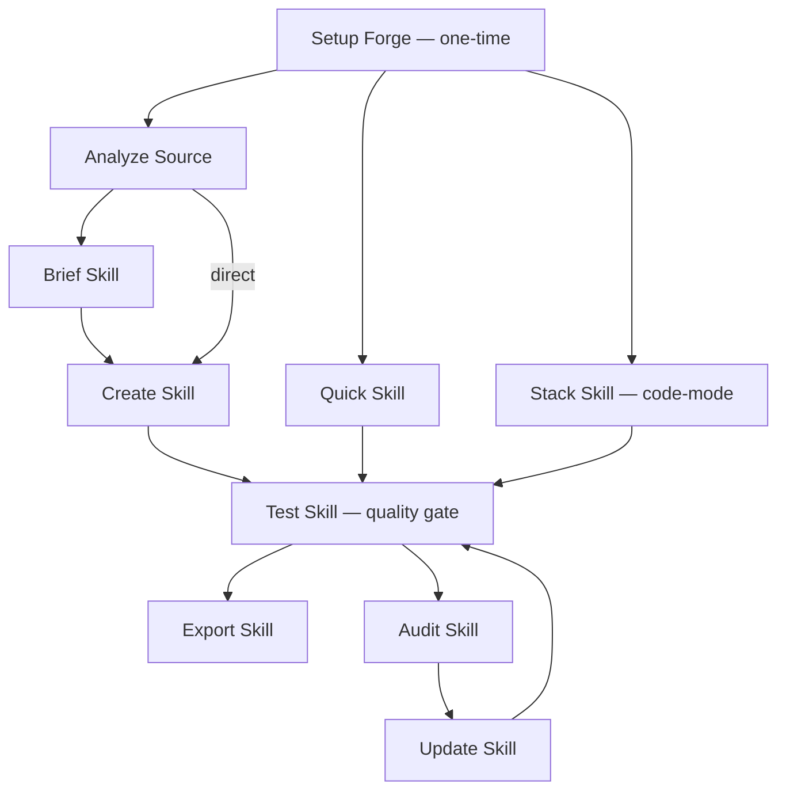
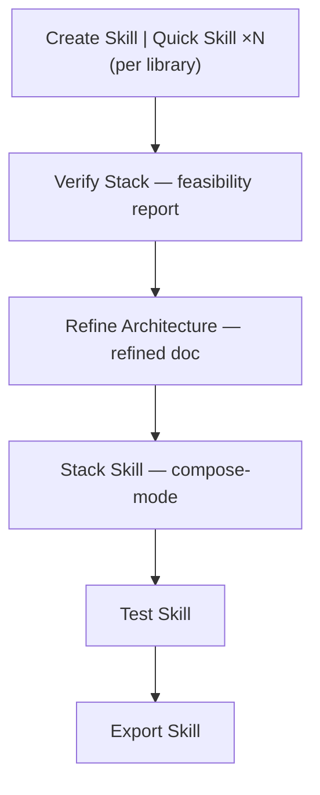

# Workflows Reference

SKF has 12 workflows. You trigger them by typing commands to [Ferris](../agents/), the AI agent that runs everything. Each workflow handles a specific part of the skill lifecycle — from analyzing source code to packaging for distribution. If any terms are unfamiliar, see the [Concepts](../concepts/) page for definitions.

---

## Core Workflows

### Setup Forge (SF)

**Command:** `@Ferris SF`

**Purpose:** Initialize forge environment, detect tools (ast-grep, ccc, gh, qmd), set capability tier, index project in CCC (Forge+), verify QMD collection health (Deep).

**When to Use:** First time using SKF in a project. Run once per project.

**Key Steps:** Detect tools + Determine tier → CCC index check (Forge+) → Write forge-tier.yaml → QMD + CCC registry hygiene (Deep/Forge+) → Status report

**Agent:** Ferris (Architect mode)

---

### Brief Skill (BS)

**Command:** `@Ferris BS`

**Purpose:** Scope and design a skill through guided discovery.

**When to Use:** Before `Create Skill` when you want maximum control over what gets compiled.

**Key Steps:** Gather intent → Analyze target → Define scope → Confirm brief → Write skill-brief.yaml

**Agent:** Ferris (Architect mode)

---

### Create Skill (CS)

**Command:** `@Ferris CS`

**Purpose:** Compile a skill from a brief. Supports `--batch` for multiple briefs.

**When to Use:** After Brief Skill, or with an existing skill-brief.yaml.

**Key Steps:** Load brief → Ecosystem check → Extract (AST + scripts/assets) → QMD enrich (Deep) → Compile → Validate → Generate

**Agent:** Ferris (Architect mode)

---

### Update Skill (US)

**Command:** `@Ferris US`

**Purpose:** Smart regeneration preserving `[MANUAL]` sections. Detects individual vs stack internally.

**When to Use:** After source code changes when an existing skill needs updating.

**Key Steps:** Load existing → Detect changes (incl. scripts/assets) → Re-extract → Merge (preserve MANUAL) → Validate → Write → Report

**Agent:** Ferris (Surgeon mode)

---

## Feature Workflows

### Quick Skill (QS)

**Command:** `@Ferris QS <package-or-url>`

**Purpose:** Brief-less fast skill with package-to-repo resolution.

**When to Use:** When you need a skill quickly — no brief needed. Accepts package names or GitHub URLs.

**Key Steps:** Resolve target → Ecosystem check → Quick extract → Compile → Validate → Write

**Agent:** Ferris (Architect mode)

---

### Stack Skill (SS)

**Command:** `@Ferris SS`

**Purpose:** Consolidated project stack skill with integration patterns. Supports two modes: **code-mode** (analyzes a codebase) and **compose-mode** (synthesizes from existing skills + architecture document, no codebase required).

**When to Use:** When you want your agent to understand your entire project stack — not just individual libraries. Use code-mode for existing projects; compose-mode activates automatically after the VS → RA verification path when skills exist but no codebase is present.

**Key Steps (code-mode):** Detect manifests → Rank dependencies → Scope confirmation → Parallel extract → Detect integrations → Compile stack → Generate references

**Key Steps (compose-mode):** Load existing skills → Confirm scope → Detect integrations from architecture doc → Compile stack → Generate references

**Agent:** Ferris (Architect mode)

---

### Analyze Source (AN)

**Command:** `@Ferris AN`

**Purpose:** Decomposition engine — discover what to skill, recommend stack skill.

**When to Use:** Brownfield onboarding of large repos or multi-service projects.

**Key Steps:** Init → Scan project → Identify units → Map exports & detect integrations → Recommend → Generate briefs

**Note:** Supports resume — if the session is interrupted mid-analysis, re-run `@Ferris AN` and Ferris will resume from where it left off.

**Agent:** Ferris (Architect mode)

---

### Audit Skill (AS)

**Command:** `@Ferris AS`

**Purpose:** Drift detection between skill and current source.

**When to Use:** To check if a skill has fallen out of date with its source code.

**Key Steps:** Load skill → Re-index source → Structural diff (incl. script/asset drift) → Semantic diff (Deep) → Classify severity → Report

**Agent:** Ferris (Audit mode)

---

### Test Skill (TS)

**Command:** `@Ferris TS`

**Purpose:** Cognitive completeness verification. Quality gate before export.

**When to Use:** After creating or updating a skill, before exporting.

**Key Steps:** Load skill → Detect mode → Coverage check → Coherence check → External validation (skill-check, tessl) → Score → Gap report

**Agent:** Ferris (Audit mode)

---

## Architecture Verification Workflows

### Verify Stack (VS)

**Command:** `@Ferris VS`

**Purpose:** Pre-code stack feasibility verification. Cross-references generated skills against architecture and PRD documents with three passes: coverage, integration compatibility, and requirements.

**When to Use:** After generating individual skills with CS/QS, before building a stack skill — to verify the tech stack can support the architecture.

**Key Steps:** Load skills + docs → Coverage analysis → Integration verification → Requirements check → Synthesize verdict → Present report

**Agent:** Ferris (Audit mode)

---

### Refine Architecture (RA)

**Command:** `@Ferris RA`

**Purpose:** Evidence-backed architecture improvement. Takes the original architecture doc + generated skills + optional VS report, fills gaps, flags contradictions, and suggests improvements — all citing specific APIs.

**When to Use:** After VS confirms feasibility, before running SS in compose-mode. Produces a refined architecture ready for stack skill composition.

**Key Steps:** Load inputs → Gap analysis → Issue detection → Improvement detection → Compile refined doc → Present report

**Agent:** Ferris (Architect mode)

---

## Utility Workflows

### Export Skill (EX)

**Command:** `@Ferris EX`

**Purpose:** Validate package structure, generate context snippets, and inject managed sections into CLAUDE.md/AGENTS.md/.cursorrules.

**When to Use:** When a skill is ready for CLAUDE.md/AGENTS.md integration. Also provides distribution instructions for `npx skills publish`.

**Key Steps:** Load skill → Validate package → Generate snippet → Update context file (CLAUDE.md/AGENTS.md/.cursorrules) → Token report → Summary

**Agent:** Ferris (Delivery mode)

---

## Workflow Connections

**Standard path (code-mode):**

**Pre-code verification path (compose-mode):**

---

## Workflow Categories

| Category | Workflows | Description |
|----------|-----------|-------------|
| Core | SF, BS, CS, US | Setup, brief, create, and update skills |
| Feature | QS, SS, AN | Quick skill, stack skill, and analyze source |
| Quality | AS, TS | Audit skill completeness and test skill accuracy |
| Architecture Verification | VS, RA | Pre-code architecture feasibility and refinement |
| Utility | EX | Package and export for consumption |
| In-Agent | WS, KI | WS: show lifecycle position, active briefs, and forge tier; KI: list knowledge fragments (both in-agent, no file-based workflow) |
